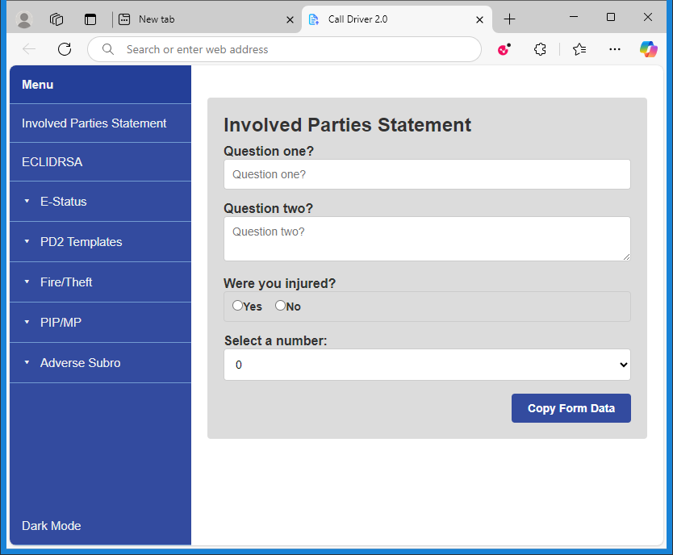
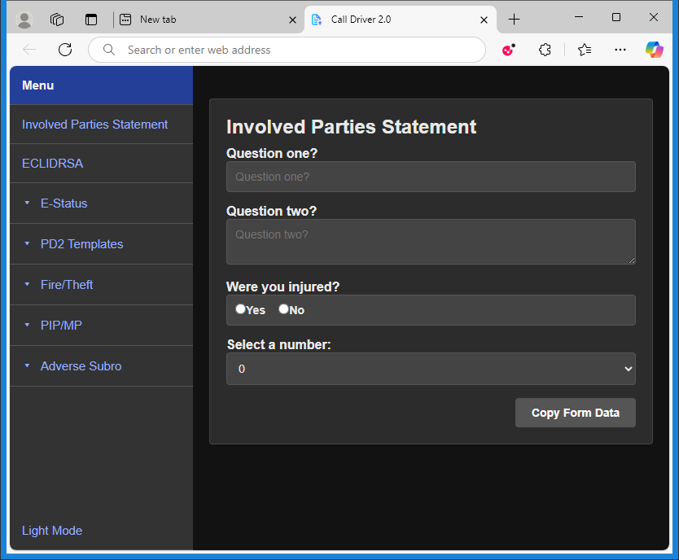

# Web-Form 2.3

A lightweight, front-end framework for rendering dynamic forms and capturing user input. This setup uses vanilla JavaScript to load template-specific questions, present them in a modern form layout, and provide helpers like copy-to-clipboard, conditional follow-ups, and repeated sections.

---

## Table of Contents
1. [Overview](#overview)  
2. [Features](#features)  
3. [Project Structure](#project-structure)  
4. [Usage](#usage)  
5. [Customization](#customization)  

---

## Overview

**Framework 2.3** is a single-page JavaScript application that dynamically loads different “templates” (configurations of questions) to render custom forms. It provides:
- A central `index.htm` that hosts the layout.
- A small set of JavaScript modules to handle menu toggling, dynamic form rendering, conditional follow-up questions, repeated fields, and copying data from the form.
- A structure for “templates” (JavaScript files in the `templates/` folder) that define a global `templateQuestions` array to power each form.

This approach lets you add or remove templates without changing core application logic—simply drop a new JS file in `templates/` and update the navigation.

---

## Features

1. **Dynamic Form Rendering**
   - Automatically generates form fields (text, textarea, radio, select, etc.) based on JavaScript arrays.
   - Shows follow-up questions for “radio” selections that trigger conditional content.
   - Supports repeated question sets via a user-provided count (e.g., how many items, children, cars, etc.).

2. **Navigation & Templating**
   - The sidebar loads a corresponding `templates/*.js` file to populate the main content area with that template’s questions.
   - A shared `renderTemplateForm()` function in `js/script.js` ensures consistent field generation.

3. **Copy-to-Clipboard**
   - A “Copy Form Data” button chunk-splits responses into multiple blocks and provides a one-click copy feature for each block.

4. **Dark Mode**
   - Simple toggle implemented via a CSS class (`dark-mode`) and `localStorage` (remembers user preference).

5. **Responsive Sidebar Menu**
   - Collapses on mobile and toggles via a hamburger icon.

6. **Help/Changelog Page**
   - A dedicated `help.js` template containing version history, troubleshooting, and release notes.

---

### Key Files

- **index.html**  
  The main page, featuring:
  - A `
` that loads form content via JavaScript.
  - References to all scripts at the bottom.

- **js/script.js**  
  - Toggles sidebar and submenus.
  - Dynamically loads template JS files when a nav link is clicked.
  - Implements a `renderTemplateForm()` function that parses `window.templateQuestions` and renders inputs.

- **js/dynamic-followups.js**  
  - Observes radio inputs with `followup` data and injects additional questions based on a chosen answer.

- **js/dynamic-repeat.js**  
  - For select-type inputs that specify a `repeat` object, it repeats a group of sub-questions as many times as the user selects.

- **js/print-form-to-screen.js**  
  - Renders a “Copy Form Data” button which, when clicked, collects all answers into text blocks (limited lines per block) and provides a copy button for each block.

- **templates/**  
  - Each `.js` file sets `window.templateQuestions` and an optional `window.templateTitle`.
  - The application’s navigation triggers these files to be loaded, which then call `renderTemplateForm()`.

---

## Usage

1. **Open `index.html`**  
   Open in your browser. The main sidebar plus a central form area will appear.

2. **Select a Template**  
   - Click any sidebar item to load its corresponding `.js` file in `/templates/`.
   - That file defines a question set, which `renderTemplateForm()` uses to build form fields automatically.

3. **Fill Out the Form**  
   - Enter information in text fields, textareas, radios, or selects.
   - Some radio selections trigger additional follow-up questions if configured.

4. **Copy Data**  
   - When finished, click **Copy Form Data**.
   - Form data is split into blocks (with line limits). Each block has its own **Copy to Clipboard** button.

5. **Dark Mode**  
   - Toggle via the “Dark Mode” link in the sidebar.
   - Uses `localStorage` to remember your choice.

---

## Customization

- **Add a New Template**  
  1. Create a new JS file in `templates/` that defines `window.templateQuestions` (and optionally `window.templateTitle`).  
  2. Update your nav menu (the items with `data-page` attributes) to point to this new template (e.g., `data-page="my-new-template"`).  
  3. Done! Clicking that menu item now loads your new template.

- **Change the Look**  
  - Edit `css/style.css` to adjust layout, fonts, spacing, or implement brand guidelines.

- **Modify Copy Behavior**  
  - `print-form-to-screen.js` handles how the data is chunked. Adjust line limits, block sizes, or the text formatting to your liking.
